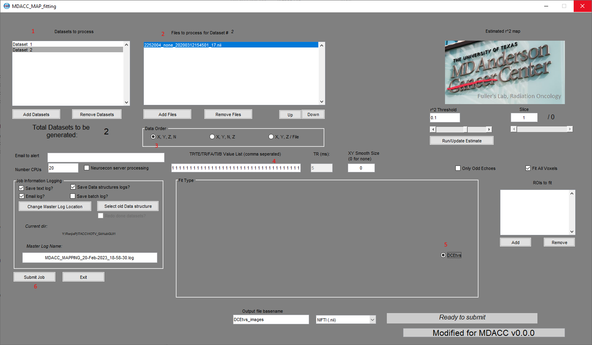

This GUI based code will let you choose multiple DCE nifti data files from various locations to fullfil HOTV in batch, the output will be exported to the same location of source data.

You need copy the three subfolders in "Batch" folder to here, include them into your path, and run fitting_gui.m. The red number in the picture below is the steps for excution, in step 4 you need input "1" in the number of your data time points.

